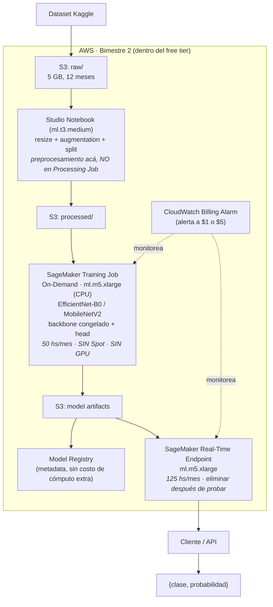

[⬅ Volver al README](../README.md)

# Arquitectura del proyecto

## Resumen

Divido el pipeline en dos fases: prototipado en entorno local (sin costo, sin límite de tiempo) y una fase formal en AWS acotada a la ventana de 2 meses del free tier de SageMaker.

## Diagrama de flujo

## Decisiones de diseño y justificación

### Por qué no uso Spot Instances
El AWS Free Tier aplica exclusivamente a instancias On-Demand de tipos específicos (`ml.t3.medium`, `ml.m4.xlarge`/`ml.m5.xlarge`). Las Spot Instances se facturan bajo un esquema aparte y no consumen ni son cubiertas por las horas gratuitas, así que las descarto.

### Por qué no uso GPU
Ninguna instancia GPU está incluida en el free tier de SageMaker. Corro todo el entrenamiento e inferencia sobre CPU (`ml.m5.xlarge`).

### Por qué el preprocesamiento va en el notebook y no en un Processing Job
Los SageMaker Processing Jobs no tienen línea de free tier propia (a diferencia de Notebooks, Training e Inferencia). Corro el preprocesamiento dentro del Studio Notebook para aprovechar horas ya cubiertas por el free tier.

### Por qué elijo un modelo liviano (EfficientNet-B0 / MobileNetV2)
Al entrenar sobre CPU dentro de las 50 horas/mes gratuitas, me conviene una arquitectura con backbone congelado (transfer learning clásico) y resolución de imagen reducida, para que el fine-tuning sea viable en un tiempo razonable.

### Ventana de tiempo del free tier
El trial de SageMaker dura 2 meses desde la creación del primer recurso SageMaker (no desde la creación de la cuenta AWS). Por eso creo el primer recurso SageMaker recién al arrancar el Bimestre 2 — cargar datos a S3 no consume ese reloj.

## Tabla resumen del free tier relevante

| Servicio | Cubierto gratis | Instancia | Duración |
|---|---|---|---|
| Studio Notebooks | 250 horas/mes | ml.t3.medium | 2 meses |
| Entrenamiento | 50 horas/mes | ml.m4.xlarge / ml.m5.xlarge (sin GPU) | 2 meses |
| Inferencia real-time | 125 horas/mes | ml.m4.xlarge / ml.m5.xlarge | 2 meses |
| S3 | 5 GB de almacenamiento, 20.000 GET y 2.000 PUT por mes | — | 12 meses |

---

**Ver también:** [documentación técnica](documentacion_tecnica.md) ·
[documentación no técnica](documentacion_no_tecnica.md) · [model card](model_card.md) ·
[desarrollo asistido por IA](desarrollo_asistido_por_ia.md)
