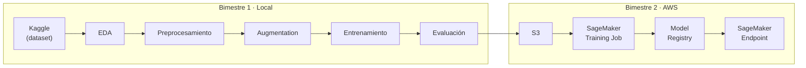

[⬅ Volver al README](../README.md)

# Documentación técnica

> Audiencia: quien tenga formación en programación/ciencia de datos y quiera entender el
> diseño del proyecto y el estado de las decisiones tomadas. Para la explicación en
> términos no técnicos, ver [`documentacion_no_tecnica.md`](documentacion_no_tecnica.md). Para el contrato
> formal del modelo, ver [`model_card.md`](model_card.md). Para el diagrama de infra en
> AWS, ver [`architecture.md`](architecture.md).

**Índice:** [Resumen del problema](#resumen-del-problema) ·
[Pipeline end-to-end](#pipeline-end-to-end) ·
[Estado de las decisiones](#estado-de-las-decisiones-de-diseño) ·
[Hallazgos del EDA](#hallazgos-del-eda-que-ya-condicionan-decisiones-posteriores) ·
[Convenciones de código](#convenciones-de-código-a-respetar) ·
[Setup](#setup-y-comandos) · [Próximos pasos](#próximos-pasos)

## Resumen del problema

Trabajo en una clasificación multiclase (4 clases: glioma, meningioma, pituitary,
notumor) de imágenes 2D de MRI cerebral, con transfer learning sobre un backbone
congelado. Ver [`README.md`](../README.md) para el objetivo general y el cronograma.

## Pipeline end-to-end

Divido el proyecto en dos fases con una regla de diseño central: **el mismo código de
`src/data/preprocessing.py` y `src/models/train.py` corre sin modificarse en ambas** —
prototipado local (Bimestre 1) y SageMaker (Bimestre 2). Por eso `train.py` lee
hiperparámetros y paths desde variables de entorno/CLI (convención SageMaker), nunca
hardcodeados.

## Estado de las decisiones de diseño

| Decisión | Estado | Detalle |
|---|---|---|
| Framework (PyTorch/TensorFlow) | **Pendiente** | Bloquea la implementación de `train.py`, `architecture.py`, `augmentation.py` |
| Arquitectura (EfficientNet-B0/MobileNetV2) | **Pendiente** | — |
| `image_size` | **Resuelto: 224×224** | Ver justificación abajo |
| `epochs`, `learning_rate` | **Pendiente** | — |
| `s3_bucket`, `region` | **Pendiente** | Bloquea Bimestre 2 |
| Split train/val/test | **Resuelto: 80/10/10** | Estratificado, seed fijo |
| Augmentation | **Parcialmente resuelto** | Ver hallazgos del EDA abajo |

## Hallazgos del EDA que ya condicionan decisiones posteriores

Ya terminé el EDA, que vive en `notebooks/01_eda.ipynb` (corre local, ver sección de
Setup del proyecto). Resumo acá lo relevante para cuando implemente
`preprocessing.py` / `augmentation.py` / `train.py`:

### 1. Balance de clases

7.200 imágenes, exactamente 1.800 por clase (25% cada una). **Dataset perfectamente
balanceado** → no hacen falta class weights ni sampling especial en la loss.

### 2. Resolución elegida: `image_size = 224`

Con `recomendar_image_size()` comparé 150/224/256 contra la distribución real de
resoluciones (dominante: 512×512, 70% del dataset). Descarté 150 porque, aunque casi no
requiere upscaling (0.6%), reduce la mayoría del dataset a menos del 10% de su resolución
original sin necesidad. Elegí 224 por alinear con la resolución preentrenada estándar de
EfficientNet-B0/MobileNetV2 sobre ImageNet, aceptando upscaling en el 11.3% de las
imágenes más chicas (vs. 18.8% con 256, por un beneficio marginal).

### 3. Mezcla de tipos de corte (axial/sagital/coronal) sin etiquetar

El dataset no trae metadata de orientación (ni en nombre de archivo ni en archivo
aparte), y mezcla las tres orientaciones estándar de MRI sin indicarlo, incluso dentro de
una misma clase. **Decisión:** saco el flip horizontal del augmentation. Un flip
horizontal es válido en cortes axiales/coronales (el cerebro es aproximadamente simétrico
izquierda-derecha) pero inválido en cortes sagitales (invierte adelante-atrás, generando
una imagen anatómicamente imposible). Sin forma barata de detectar la orientación por
imagen, prefiero no arriesgarme a corromper el subconjunto sagital.

### 4. Diferencias sistemáticas de intensidad/contraste por clase — probable artefacto de composición

Con `estadisticas_intensidad()` encontré diferencias marcadas de brillo, contraste y
fracción de fondo negro entre clases (glioma la más oscura, "sin tumor" la más clara y
contrastada). Investigando la composición documentada del dataset (Kaggle + IEEE
DataPort): la clase **notumor proviene 100% de Br35H**, mientras que **glioma viene de
figshare** y **meningioma/pituitario mayormente de SARTAJ** — fuentes con protocolos de
adquisición distintos. La correlación que veo coincide con la composición por fuente, no
con una diferencia clínica confirmada.

**Decisión:** el augmentation de brillo/contraste no es opcional — es mi mitigación
directa contra el riesgo de que el modelo aprenda a distinguir "de qué fuente vino la
imagen" en vez de patología real. Lo documento también como limitación en
[`model_card.md`](model_card.md).

### 5. Duplicados exactos: 4.72% del dataset

Con `detectar_duplicados()` encontré 340 archivos (153 grupos) duplicados byte a byte,
ninguno cruzando clases distintas, concentrados en notumor (~64% de los duplicados) —
otra pista a favor del hallazgo anterior. **Decisión:** deduplico antes del split
estratificado propio (`preprocessing.split_dataset()`), no del split Training/Testing
original de Kaggle — este último no me protege contra fuga de datos porque lo descarto.

## Convenciones de código a respetar

- `src/data/eda.py` es el único módulo de `src/` que ya implementé; el resto son stubs
  con `NotImplementedError` cuyo docstring especifica el contrato a implementar.
- `src/inference/inference.py` implementa las 4 funciones fijas de SageMaker script mode
  (`model_fn`, `input_fn`, `predict_fn`, `output_fn`); nombres y firmas los impone
  SageMaker, no son negociables.
- `src/pipeline/sagemaker_pipeline.py` lo dejo como stretch goal opcional, no prioritario.
- Las restricciones duras de infra (on-demand sin Spot, sin GPU, preprocesamiento en
  Studio Notebook y no en Processing Job) están detalladas en `architecture.md` — no son
  preferencias de estilo, son lo que mantiene el proyecto dentro del free tier de AWS.

## Setup y comandos

Ver la sección "Cómo correr en local" de [`README.md`](../README.md) para el setup del
entorno (venv, kernel de Jupyter, credenciales de Kaggle).

## Próximos pasos

1. Decidir framework y arquitectura (bloquea todo el modelado).
2. Implementar los stubs de `preprocessing.py`, `augmentation.py`, `train.py`,
   `evaluate.py` respetando sus docstrings y las decisiones que ya tomé arriba.
3. Bimestre 2: subir a S3, resolver `s3_bucket`/`region`, portar `train.py` a SageMaker.

---

**Ver también:** [documentación no técnica](documentacion_no_tecnica.md) ·
[model card](model_card.md) · [arquitectura en AWS](architecture.md) ·
[desarrollo asistido por IA](desarrollo_asistido_por_ia.md)
